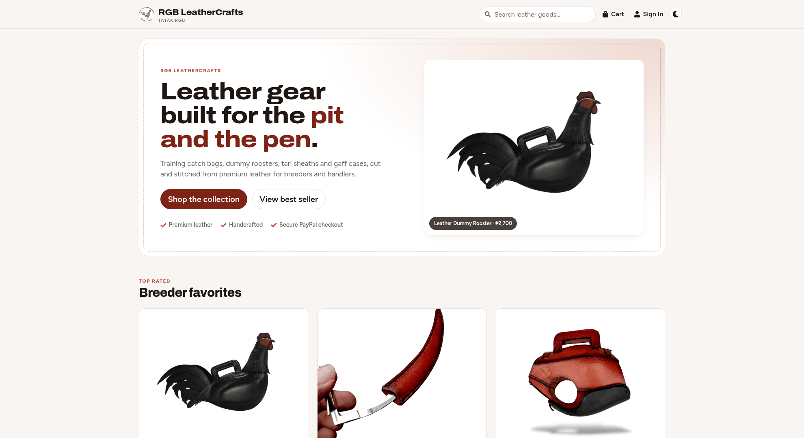

# RGB LeatherCrafts eCommerce Website

> eCommerce platform built with the MERN stack & Redux.



## Features

- Full featured shopping cart
- Product reviews and ratings
- Top rated products showcase
- Product pagination
- Product search feature
- User profile with orders
- Admin product management
- Admin user management
- Admin Order details page
- Mark orders as delivered option
- Checkout process (shipping, payment method, etc)
- PayPal / credit card integration
- Light and dark mode
- Database seeder (products & users)

## Tech Stack

- **Backend:** Node.js 22+, Express 5, MongoDB with Mongoose 9, JWT auth (HTTP-only cookie)
- **Frontend:** React 19, Vite 8, Redux Toolkit 2 (RTK Query), React Router 8, React Bootstrap with Bootstrap 5.3
- **Payments:** PayPal

## Getting Started

### Environment variables

Copy `.env.example` to `.env` in the project root and fill in your values:

```
NODE_ENV=development
PORT=5000
MONGO_URI=your-mongodb-connection-string
JWT_SECRET=change-me
PAGINATION_LIMIT=8
PAYPAL_CLIENT_ID=your-paypal-client-id
PAYPAL_APP_SECRET=your-paypal-app-secret
PAYPAL_API_URL=https://api-m.sandbox.paypal.com
```

### Install dependencies

```
npm install
npm install --prefix frontend
```

### Run

```
# Frontend (:3000) and backend (:5000) together
npm run dev

# Backend only
npm run server
```

The Vite dev server proxies `/api` and `/uploads` to the backend.

### Build & deploy

```
# Installs dependencies and builds the frontend into frontend/dist
npm run build

# Serves the API and frontend/dist (set NODE_ENV=production)
npm start
```

### Seed the database

```
# Import sample products and users
npm run data:import

# Destroy all data
npm run data:destroy
```

## License

MIT
